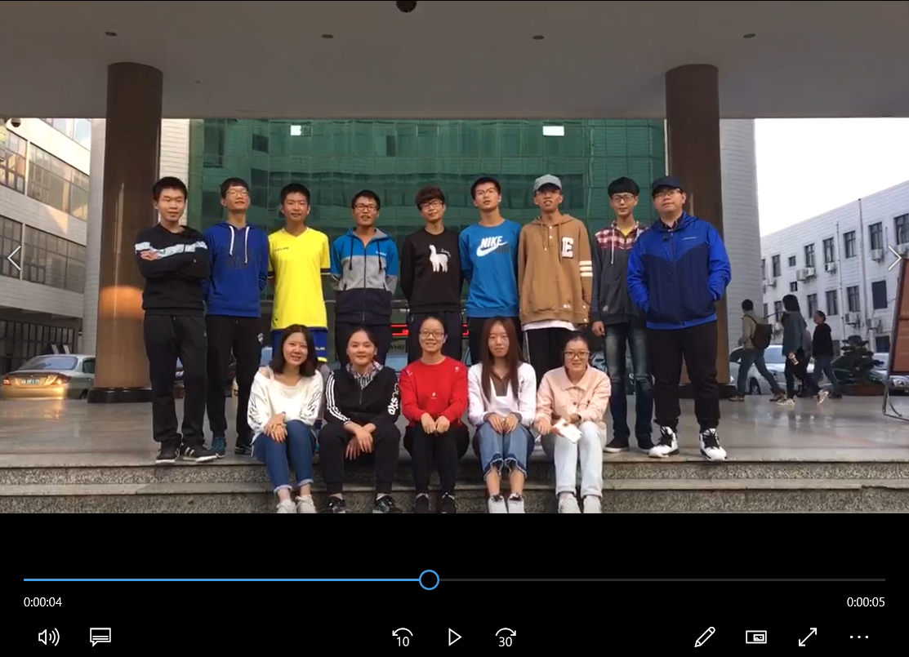
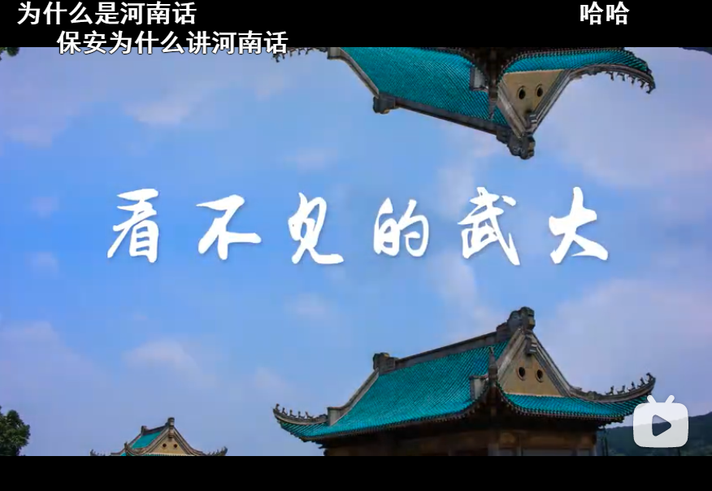
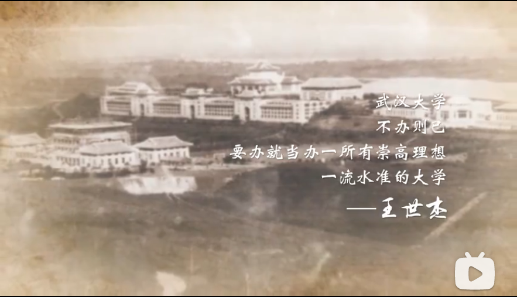
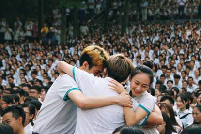

很早就有动笔写回忆录的想法，记录一下飞驰而过的二十年人生。倒不是为了总结些什么人生经验，只是想在花甲古稀之年还能恍然发现，原来在很久很久之前，自己度过了一段很好很好的时光。

2021年，大学毕业之际。决定先从大学时代动笔。最近看到朋友圈好多毕业照，才突然意识到自己在珞珈山的日子也要掰着手指计算了。

严格意义上讲，我的大学时代起于2017年高考结束，终止于2021年6月。
<!--more-->

### 一波三折的专业

高考结束后，放纵了几天，在爸妈的强制要求下就开始对答案提前选专业了。结合当时的估分(580-600)和往年的位次，以及自己感兴趣的专业把目光锁定在了中国药科大学，中国传媒大学等几所211和西北农林科技，西北工业大学等几所985.专业也都是药学，生物，化学，数字媒体等方向。爸妈还精心制了一张专业选择顺序表。

6.24晚上我呼呼大睡，妈妈把我从梦中叫醒，一边埋怨着之前的志愿选择作废了，一边笑着说分数是624. 于是志愿就定在了中九档：武大，厦大，中山，北理，天大，北邮。第一志愿毫无纠结填了梦校武大，当时我对化学，生物，药学以及信息类学科特别感兴趣。当时特别想报武大的相关专业，但是怎么排序是个问题，后来爸妈打电话问了朋友，我也咨询了学长学姐。发现药学分数很高，化学生物不太好就业，最终我填报的全都是信息类专业。冲着武大遥感世界第一的title，第一志愿报了遥感。但是遥感分数太高，最终录取到了第四志愿软件工程，当时还失落了一阵，后来才发现阴差阳错竟是最好的选择。

来了武大之后，就开始了卓越班分班。当时国际软件学院卓越班有两个专业：软件工程和空间信息与数字技术。当时一查，好家伙，空信专业堪比遥感，也是全国第一，再加上当时没录到遥感的耿耿于怀，想都没想直接报了空信。于是第一届也是最后一届空信卓越班成立了，计划招收30人，最终报名14人。感觉我们是历史性的一届，在手机相册里翻了好久也没有找到合影，恍然发现大一时候熬夜肝的班级视频里刚好有一段可以截取出来哈哈哈哈。

> “我们拥有全国软最高的男女比例”
>
> “我们有着全国软最高的出勤率”
>
> “我们班一半都是班委”
>
> “我们班有着炫酷的名字”
>
> “我们班半年后就解散了(乱入)”

结果在大一上学期上完后，面临着国软合并计院趋势，软工进入计算机学院，空信进入遥感学院。但是因为大一的空信卓越班没上什么专业课，学院领导又给了我们一次选择，计院or遥感？

当时我还是特别想去遥感，但是因为大一上课认识的同学都在计院，不太想进入一个新环境，所以最后还是留在了计院，进了软工(非卓越)班。还因为不是卓越班心里愤愤不平，后来大一下又有一次专业分流的机会去遥感，但是当时也没选遥感哈哈哈。

事实证明，无论是专业录取时的阴差阳错和院系合并后的不甘选择在日后看来都是相对正确的。没有进遥感而进了国软，才让我进入了相对好就业的计算机行业。没有进卓班而进了普通班，才让我在最终保研时拿到了一个还不错的排名。

### 珞珈初识
17年的九月初，初秋的凉爽中还夹杂着末夏的温热，爸妈和我驾车踏上了前去武汉的征程。抵达珞珈山后，鉴湖的那一抹盎然生机一扫五个小时车程的疲惫，我也随手拍下了接天莲叶并赋诗一首:

> 笑艳秋莲生绿浦，
>
> 柳塘新绿却温柔。
>
> 本是初识珞珈时，
>
> 却似久别遇旧友。

鉴湖的亲切和活力是武大带给我的第一印象。后来竟被辅导员告知诗还发到了武大教育发展基金会的公众号上，我爸还把诗拿给单位懂诗词创作的伯伯做了修改。赏析我现在还依旧保存着。这也为我大二时申请的创新创业项目埋下了伏笔。

离开了鉴湖之后，就和爸妈去了牌坊。武大给我的第二印象是"自强、弘毅、求是、拓新"的校训。

开学典礼是和爸妈一块参加的。那也是最后一次在梅操开学典礼，后面从18级开始就换到了新建成的卓尔体育馆。典礼开始放了纪录片《看不见的武大》，开篇的河南话让我倍感亲切。直到现在每当我看到这个纪录片都会内心暗暗自豪，哦，原来我也是一个武大人了!

> 看不见的武大叫"珞珈"  
> 看得见的是牌坊，看不见的是历史;  
> 看得见丰硕的科研成果，看不见代代珞珈科研工作者的辛勤付出;  
> 武大人是深沉大气的，是聪慧浪漫的，武大人为人所见或不为人知的每一面，都值得我们铭记。  

"开放、包容、自由、创新"是武大给我的第三印象。

记得当时有一个特别有意思的环接，摄像机会随机对准两个坐在一块的同学，然后大屏幕上就会用心形把两个同学框起来，被框起来的同学要相互拥抱。(嗯还好没有框到我，毕竟旁边坐的也不是妹子)

毕业典礼进行了一半多，有意思的环接也差不多结束。这时候"王书记"发短信叫我一块去看新上映的蜘蛛侠。走到信部的时候，爸妈给我发消息找我，说开学典礼结束就要回家了。看到他们急匆匆赶来信部找我，我突然心酸，上大学是我第一次长时间离家，或许我和他们都还没有做好准备。但时间到了总要辞行~