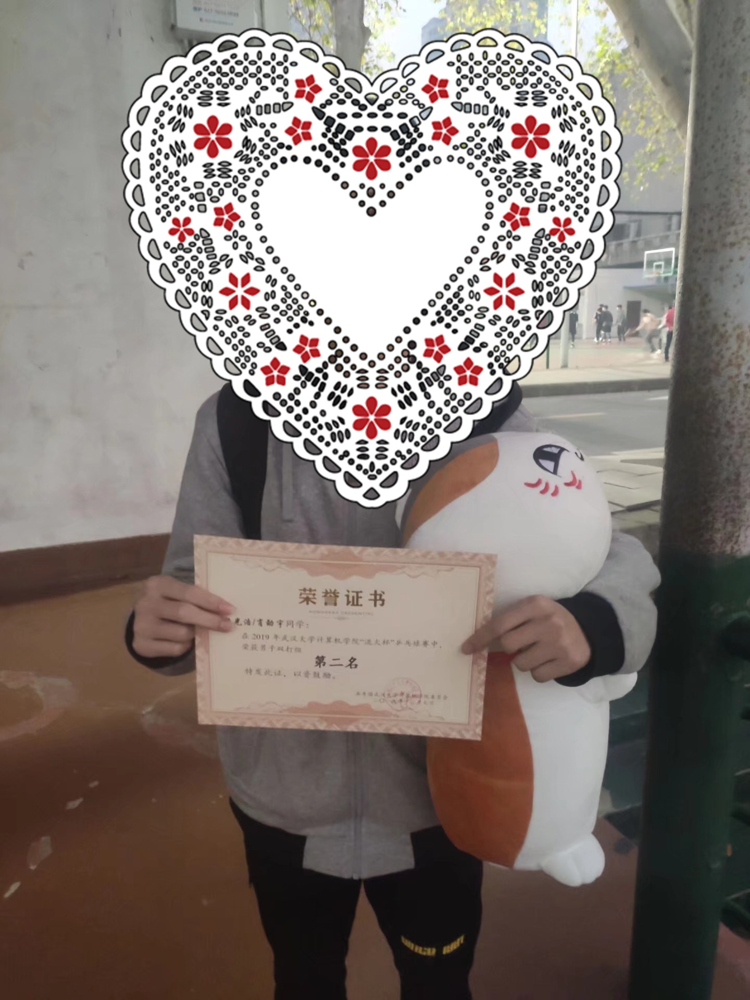
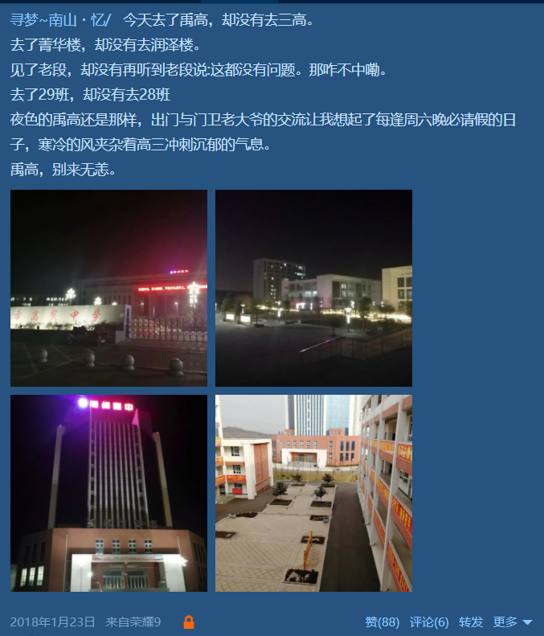

大一一年经历了三次分班(军训分班，卓越班选拔，空信卓越班解散)，还记得当时国软解散前夕上了一波表白墙, 所以大一期间班级层面并没有给我带来特别强烈的归属感。倒是当时凭兴趣加入的社团实践部和乒乓球队给我带来了强烈的归属感，到了现在尽管自己已经离开了实践部，也从乒乓球队退役。社团的同学现在依旧是一块比赛，实践，卷保研并肩作战的小伙伴。社团的学长学姐也在我大学的重要阶段给予了很大的帮助。  
<!--more-->

### 乒乓球队

我很早就会打球了，在小学的时候还正规训练过一段时间。但是后来因为时间原因给搁置了，到了上大学前一直是个半吊子。我入学之时，正值国软球队巅峰时期。从13年建队到17年蒋队执掌，加上16年新生杯冠军郭队的加入，国软的实力在全校可以排进前三。

还记得那是军训的一个下午，我和凡哥一块来到了体育馆，当时蒋队和郭队正在训练，拧拉，高调，爆冲，发球转不转各种技术运用得十分灵活，我差点以为这是院队的平均水平。后来进队之后才发现是天花板哈哈哈。  

球队给我印象最深刻的是三年校乒赛。

**17年校乒赛**是国软巅峰，历届球队队长都在。郭队更是拿了2016年新生杯冠军，蒋队拿了2016年精英杯亚军。最终一路过关斩将，以仅输一场的成绩拿到了校乒赛团体季军。  

赛后球队在桂圆喝的伶仃大醉，蒋队拍着我们的肩膀说"希望你们能够练出来，这样下一届老郭也好带"。归来时已经是夕阳在山，人影散乱。  

**18年校乒赛**如图:  

18年校乒赛结束后，失落了一阵后开始加紧训练，寒假回家后也经常去球馆打球。开始技改(18年我正式从直板改为了横板)。过了两个月后感觉自己正反手和发球都回到了和之前一样的水平，下学期的体育课也索性选了乒乓球。在大循环赛上输掉的几场比赛也帮助自己找到了心态问题。到了19年上半年感觉自己的技术已经达到了一个较好的状态，发球变化多了起来，也有了落点意识，正反手的衔接也更加流畅。然后参加了19年的精英杯，竟然拿到了第五名的成绩，这也是我球队生涯的最好单项成绩了。  

**19年流火杯**是考试周，本来不打算参加比赛的，结果学弟叫我组个双打，于是就去了，结果拿到了双打第二名的成绩。决赛的对手是体特kunkun确实也没什么机会。嗯这张照片太憨了，得遮起来。  

**19年校乒赛**，郭队也退役了，这也是我和邹队第一次参加校乒赛团体。抽签抽到了第一临床和电信。一临的实力很强，确实没有挣扎的机会。赢了电信就能出线。邹队和我都赢了对面的男二，邹队输了对面男一，女生那场我们也输了。大比分来到了2:2平。我赢了电信男一就能出线。第一局对面正手爆虫大角度很刁钻,实在防不住。第二局我调整节奏开始变化发球和落点,扳回一局。决胜局感觉对面心态出了问题开始频频失误,到了10:8的时候,邹队给我叫了暂停让我稳一稳, 最终以11:9拿下了决胜局。艰难出线。  

但是最终还是16进8的时候在绝对压制下输给了生科院。至此也就结束了三年校乒赛之旅。  

**20年** 2020年上半年的时间基本都在准备保研,也因为疫情原因没有返校,打球的时间也少了。下半年尘埃落定后,去腾讯实习。虽然错过了20年的校乒赛，不过却恰巧赶上了腾讯北分乒乓球赛, 竟然还进了8强哈哈。  

**21年精英杯**也是我在武大的最后一站比赛了，报名了男单和男双，第一天都顺利出线。第二天遇到的对手是个研究生学长，正手反胶,反手正胶。开盘两局打的很不适应,搓球总是冒高,拉球总是出界。学长的基本功也很强，基本没有无畏失误。到了第三局我发现了学长的反手弱点。于是针对反手开始发勾手发球，变化上下旋。连吃了几个之后，学长的心态有所变化，无谓失误也开始增多。我又艰难扳回了两局。决胜局的时候感觉俩人都不敢打了哈哈哈,然后僵持到10:8我拿到了赛点。现在回想起来当时应该叫个暂停的。结果轮到学长发球,我连吃了两个发球。到10:10的时候,学长开始坚定进攻。最终我以10:12遗憾输掉了比赛，止步16强。 最后下午的双打和zlgg一块拿到了第五名的成绩,我在武大的乒乓球生涯也结束了。  

### 实践部

刚入学时，一直在纠结要不要加学生会。当时学院组织了各个部门的宣讲，到了实践部的时候，瞬间就被部长小姐姐那一身仙气飘飘的汉服吸引了，最后面试也顺利通过，加入了实践部。(后来大二留部后被问到为什么当时选择实践部，我还一脸正经地说:"因为加入实践部可以提升我各方面的能力"哈哈哈哈)

寒假母校回访，暑期社会实践，青春导航和青春寻访应该是实践部最有特色的活动了。(暑期实践会开新的一篇写写~)

**国软裁缝团(金秋服饰大赛)**
然而我参加的第一个活动, 竟然是做衣服。当时正值金秋服饰大赛，每个部门要出一名"裁缝"做衣服。于是"国软皇室裁缝团"成立了(不是这个名字好中二是怎么回事)，当时刚军训完, 每天都要去国软2楼排练厅做衣服做到晚上10点多。在家里都没学会针线活的我,在大学缝缝补补都学会了..当时觉得生活很充实, 白天上课, 晚上缝衣服甚至做模特。(看我一脸生无可恋的表情哈哈哈哈)  

  
不过裁缝团还是有好处的，金秋那天可以免票去看比赛。那也是我大学期间唯一一次去看金秋, 看着台上礼仪队队员把衣服撑起来的那一刻, 觉得一个月的努力都值了。
**国软国软, 牛逼闪闪**  

**轰趴 圣诞节互换礼物**
国软实践部是一个很有人情味儿的部门, 每个同学生日的时候部门都会准备礼物然后大家一块过生日，然后圣诞节也会互换礼物。我和部门一个同学恰巧是同一天生日, 于是定了个时间去homeparty刷夜, 刚好过生日。那是我第一次去轰趴, 感觉也是去的最大的一个轰趴了。里面KTV, 麻将, 游戏机, 私人影院。晚上和帅帅躺在一张床上看完"这个杀手不太冷"后开始促膝长谈中期大会的剧本，最终决定让旭少女装。po一张女装图哈哈哈哈:

圣诞节互换礼物(我送出了一个生肖钧瓷哈哈哈哈)    

**寒假实践**
大一下因为院系合并, 寒假实践没办法在国软立项~于是和几个高中小伙伴组队立项立在了电信院。  
  
上台讲到武大男女比例1:1后, 竟然被学弟问到有没有脱单(手动黑脸)  

**青春寻访**
下学期随着国软和计院合并的趋势, 实践部也迎来了新新实践部。青春寻访也是下学期最重要的一个活动。也是通过这次活动我认识了计院实践部和组织部的小伙伴珊珊，欣妍，嘉欣，健健，浩南...当时采访的学姐的一句话一直印在我的脑海里"低头做实事, 抬头看远方"。  

(去年实践部和球队的学长学姐毕业因为疫情也没机会合个影, 今年希望毕业典礼的时候他们能回来一块合个影哈哈哈)